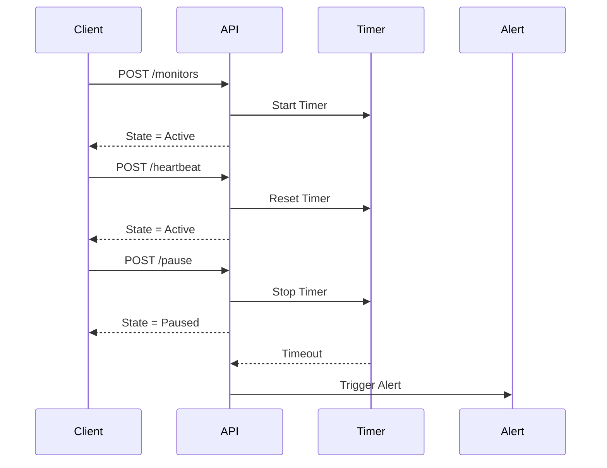

# Pulse-Check-API ("Watchdog" Sentinel)
## Architecture Sequence Diagram

# Transition Rules (Strict)
1. POST /monitors
Null → Active
Starts timer
If already exists:
Reject (409 Conflict)
2. POST /heartbeat
Active → Active → reset timer
Paused → Active → start timer
Down → (ignored or rejected) ← important constraint
3. POST /pause
Active → Paused → stop/clear timer
Paused → Paused (idempotent)
Down → (invalid)
4. Timeout Event
Active → Down
Trigger alert exactly once
Timer must not continue running after this 
