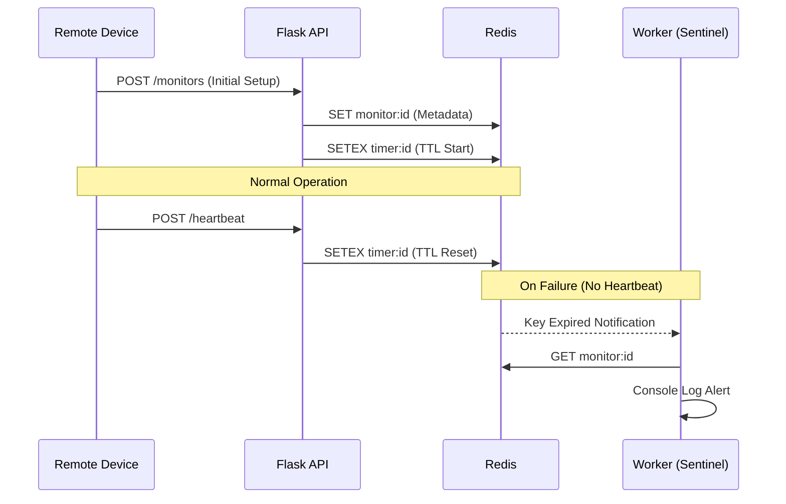

# Pulse-Check-API ("Watchdog" Sentinel)
## Architecture Sequence Diagram
The system follows an event-driven pattern using a Shadow Key strategy
 1. Metadata Key: Stores device info permanently
 2. Timer Key: A volatile key with TTL (Time-To-Live)
 3. The Sentinel: A background worker listening for the expired event to trigger alerts.

## Tech Stack
Language: Python 3.x

Framework: Flask (API Layer)

State Store: Redis (Expiration & Metadata)

Concurrency: Event-driven Pub/Sub worker

## Setup Instructions
Prerequisites
Python 3.8+
Redis Server (running on localhost:6379)

Installation
Clone the repository:

Bash
git clone <https://github.com/ronaldkarangwa/AmaliTech-DEG-Project-based-challenges.git>
cd Pulse-check
Install dependencies:

Bash
pip install flask redis
Enable Redis Expiration Events:
This system requires Redis notifications to be turned on:

Bash
redis-cli CONFIG SET notify-keyspace-events Ex
Running the System
You must run the API and the Worker in two separate terminal windows:

Window 1 (API): python app.py

Window 2 (Sentinel): python alert.py

## API Documentation
Endpoint,Method,Description
/monitors,POST,Registers a new device and starts the countdown.
/monitors/<id>/heartbeat,POST,Resets the timer to the original duration.
/monitors/<id>/pause,POST,Stops the timer (Maintenance Mode).