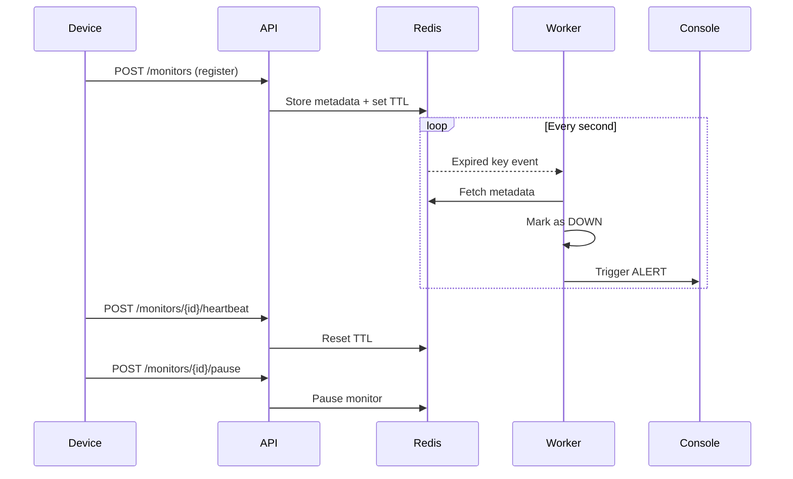

<<<<<<< HEAD
# DEG Project Challenges

This repository contains the DEG training project challenges across multiple tracks:

- Backend
- Data Engineering
- Fullstack
- QA
- DevOps

Each challenge is self-contained inside its folder and includes its own README with task details.

## Applicant Guide

If you are applying, start by choosing the challenge folder that matches your track or assigned task. Then open the README inside that folder.

The challenge-specific README files include:

- Challenge description and requirements
- Expected deliverables
- Submission guidelines and deadlines (where applicable)
- Any setup instructions or constraints

## Where To Start

1. Open the relevant track folder (for example, `backend/`, `data-engineering/`, or `fullstack/`).
2. Enter the challenge project folder.
3. Read that project's `README.md` completely before starting work.
4. Follow the listed deliverables and submission instructions exactly.

If instructions differ between this root README and a challenge README, treat the challenge README as the source of truth.
=======
# Pulse-Check-API (Watchdog Sentinel)

A lightweight **Dead Man’s Switch backend service** designed to monitor remote devices and trigger alerts when they stop sending heartbeats.

---

## 🚀 Overview

CritMon Servers Inc. monitors remote infrastructure (e.g., solar farms, weather stations) where connectivity is unreliable. Devices must periodically send “I’m alive” signals.

This project implements a **stateful timer system** that:

* Registers devices with a timeout
* Resets timers on heartbeat signals
* Automatically triggers alerts when devices go silent

---

## 🧠 Architecture



---

## ⚙️ Tech Stack

* Python 3.11
* Flask (API)
* Redis (state + TTL timers)
* Redis Pub/Sub (event-driven alerts)

---

## 📦 Setup Instructions (Local / Chromebook)

### 1. Clone Repository

```bash
git clone <https://github.com/ronaldkarangwa/AmaliTech-DEG-Project-based-challenges.git>
cd Pulse-Check
```

### 2. Create Virtual Environment

```bash
python3 -m venv venv
source venv/bin/activate
```

### 3. Install Dependencies

```bash
pip install -r requirements.txt
```

### 4. Start Redis (IMPORTANT)

```bash
redis-server --notify-keyspace-events Ex
```

---

## ▶️ Running the System

Open **3 terminals**:

### Terminal 1 — Redis

```bash
redis-server --notify-keyspace-events Ex
```

### Terminal 2 — Alert Worker

```bash
source venv/bin/activate
python3 alert.py
```

Expected:

```
Alert system is running and listening for expired keys...
```

### Terminal 3 — API Server

```bash
source venv/bin/activate
python3 app.py
```

---

## 📡 API Endpoints

### 1. Register Monitor

`POST /monitors`

```json
{
  "id": "device-123",
  "timeout": 60,
  "alert_email": "admin@critmon.com"
}
```

Response:

```
201 Created
```

---

### 2. Send Heartbeat

`POST /monitors/{id}/heartbeat`

Resets the timer.

Response:

```
200 OK
```

---

### 3. Pause Monitor (Bonus Feature)

`POST /monitors/{id}/pause`

Stops monitoring temporarily.

---

## 🧪 Testing the System

### Create a monitor

```bash
curl -X POST http://127.0.0.1:5000/monitors \
-H "Content-Type: application/json" \
-d '{"id":"test1","timeout":5,"alert_email":"a@b.com"}'
```

### Expected behavior:

* Wait ~5 seconds
* Alert appears in worker terminal:

```json
{
  "ALERT": "Device test1 is down!",
  "time": "2026-..."
}
```

---

## 🚨 Alert Logic

* Redis TTL expiration triggers event
* Worker listens via Pub/Sub
* On expiration:

  * Monitor marked as `down`
  * Alert is logged (simulating webhook/email)

---

## ⭐ Developer’s Choice Feature

### A simple react website to visualize the data

The addition of a frontend improves the system in the following ways:

* Observability: Provides a real-time view of device states instead of relying on logs
* Usability: Enables interaction with the API through a simple interface
* Demonstration: Makes it easier to showcase the system’s behavior during testing and evaluation
* Real-world alignment: Monitoring systems typically include dashboards for human operators

---

## 🔧 Design Decisions

* **Redis TTL** used for efficient timer management
* **Pub/Sub model** enables event-driven architecture
* **Separation of concerns**:

  * API → state updates
  * Worker → alert handling

---

## ⚠️ Known Limitations

* Redis keyspace notifications must be enabled manually
* Alerts are logged (not sent via real email/webhook)
* In-memory Redis (no persistence configured)

---

## 🚀 Future Improvements

* Webhook / email integration
* Retry mechanism for alerts
* Distributed worker system
* Redis persistence / clustering

---

## 🏁 Conclusion

This project demonstrates:

* Stateful backend design
* Event-driven architecture
* Real-world monitoring system patterns

---

## 👨‍💻 Author

Gahima Karangwa Ronald
>>>>>>> 173d9fd (Added a README for the frontend Developer's choice feature)
